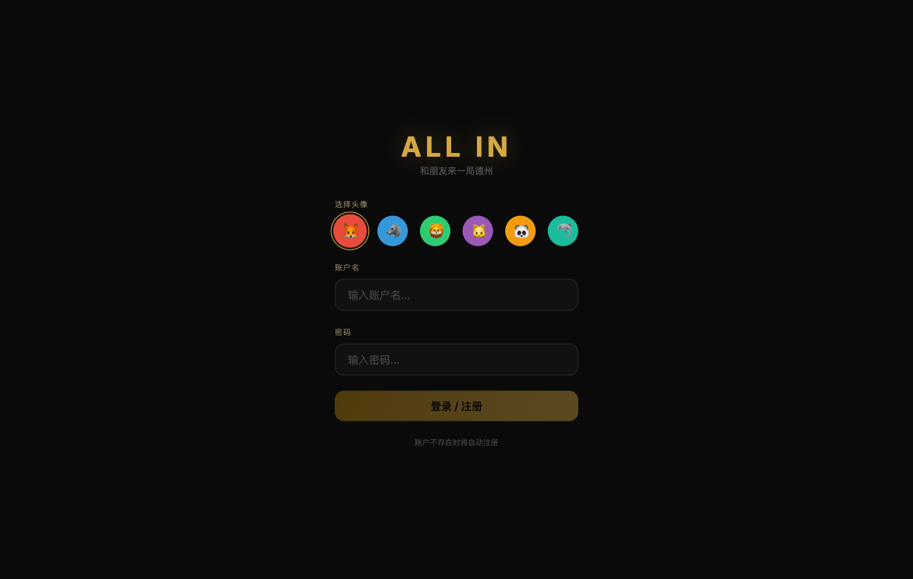
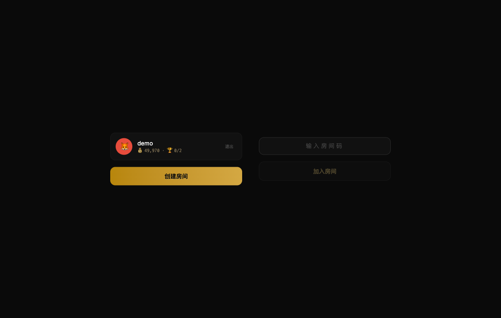
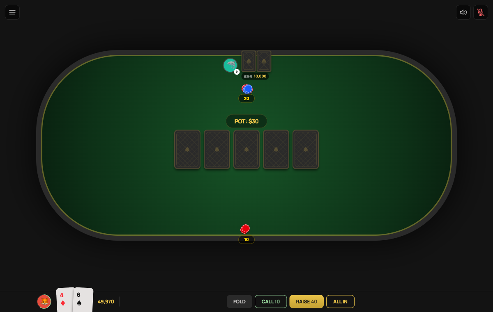

# ALL IN — Texas Hold'em Poker

A full-stack, real-time multiplayer Texas Hold'em poker game with AI opponents and voice chat.

> **Live Demo**: [texas-holdem-production-c30c.up.railway.app](https://texas-holdem-production-c30c.up.railway.app)

## Screenshots

<p align="center">
  
  
  
</p>

<p align="center">
  <em>Login &nbsp;·&nbsp; Lobby &nbsp;·&nbsp; Game Table</em>
</p>

## Features

- **Real-time Multiplayer** — WebSocket-based, supports 2–8 players per room
- **AI Opponents** — 4 personalities (Shark, Maniac, Rock, Fox) powered by Claude API + rule-based fallback
- **Voice Chat** — LiveKit integration with mic/speaker toggle and speaking indicators
- **Mobile Optimized** — PWA, forced landscape, touch-friendly controls, WeChat WebView compatible
- **Persistent Accounts** — SQLite-backed user system with chip balance tracking
- **Sound Effects** — Card dealing, chip sounds, turn alerts
- **Chip Animations** — Bet push-in, pot collection, winner glow effects

## Tech Stack

| Layer | Technology |
|-------|-----------|
| **Frontend** | React 19 · TypeScript · Tailwind CSS 4 · Zustand · Vite |
| **Backend** | Hono.js · WebSocket (ws) · tsx |
| **Database** | SQLite (better-sqlite3) · WAL mode |
| **Auth** | JWT · bcryptjs |
| **AI** | Claude API (Haiku) · poker-evaluator · Monte Carlo equity |
| **Voice** | LiveKit (client + server SDK) |
| **Deploy** | Docker · Railway |

## Architecture

```
texas-holdem/
├── packages/
│   ├── shared/          # Types, WebSocket protocol, poker utils
│   ├── client/          # React SPA (Vite)
│   │   ├── components/  # Login, Lobby, WaitingRoom, SettleOverlay
│   │   ├── game/        # PokerTable, PlayerSeat, PlayingCard, ChipPile
│   │   ├── hooks/       # useVoice (LiveKit)
│   │   ├── stores/      # Zustand game store
│   │   └── lib/         # WsClient, SoundManager
│   └── server/          # Hono HTTP + WebSocket server
│       ├── ai/          # AI decision engine + personalities
│       ├── engine/      # Game state machine, hand evaluator, pot calculator
│       ├── rooms/       # Room lifecycle management
│       ├── ws/          # WebSocket message routing
│       ├── auth/        # JWT signing/verification
│       └── db/          # SQLite setup + user repository
├── Dockerfile
└── docker-compose.yml
```

### Data Flow

```
Client (React + Zustand)
  ↕ WebSocket (JSON events)
Server (Hono + ws)
  ├── RoomManager → GameEngine → HandEvaluator
  ├── AIPlayerManager → Claude API / Fallback Rules
  ├── UserRepository → SQLite
  └── LiveKit Token → Voice Chat
```

## Getting Started

### Prerequisites

- Node.js 20+
- pnpm 10+

### Installation

```bash
git clone https://github.com/lhz960904/texas-holdem.git
cd texas-holdem
pnpm install
```

### Environment Variables

Create `packages/server/.env`:

```env
# Optional — voice chat (LiveKit Cloud)
LIVEKIT_URL=wss://your-project.livekit.cloud
LIVEKIT_API_KEY=your-api-key
LIVEKIT_API_SECRET=your-api-secret

# Optional — AI decisions (Claude API)
ANTHROPIC_API_KEY=your-anthropic-key
```

> Without LiveKit vars, voice chat is silently disabled. Without Anthropic key, AI uses rule-based fallback.

### Development

```bash
pnpm dev
```

This starts both the client (Vite, port 5173) and server (tsx, port 3001) with hot reload.

### Production Build

```bash
pnpm build
pnpm --filter @texas-holdem/server start
```

### Docker

```bash
docker compose up --build
```

The app will be available at `http://localhost:3001`.

## Deployment (Railway)

```bash
# Login to Railway
railway login

# Link to project
railway link

# Deploy
railway up

# Add persistent volume for SQLite
railway volume add -m /app/packages/server/data

# Set environment variables in Railway dashboard:
# LIVEKIT_URL, LIVEKIT_API_KEY, LIVEKIT_API_SECRET, ANTHROPIC_API_KEY
```

## Game Rules

Standard No-Limit Texas Hold'em:
- Each player gets 2 hole cards
- 5 community cards dealt in stages (Flop / Turn / River)
- Best 5-card hand wins
- Actions: Fold, Check, Call, Raise, All-In
- Side pots supported for all-in scenarios

## AI Personalities

| AI | Style | Description |
|----|-------|-------------|
| 🦈 Shark | Tight-Aggressive | Calculates odds, only plays strong hands |
| 🐕 Maniac | Loose-Aggressive | Unpredictable, frequent raises and bluffs |
| 🪨 Rock | Tight-Passive | Ultra-conservative, only premium hands |
| 🦊 Fox | Balanced | Adapts strategy, reads opponents |

## License

MIT
